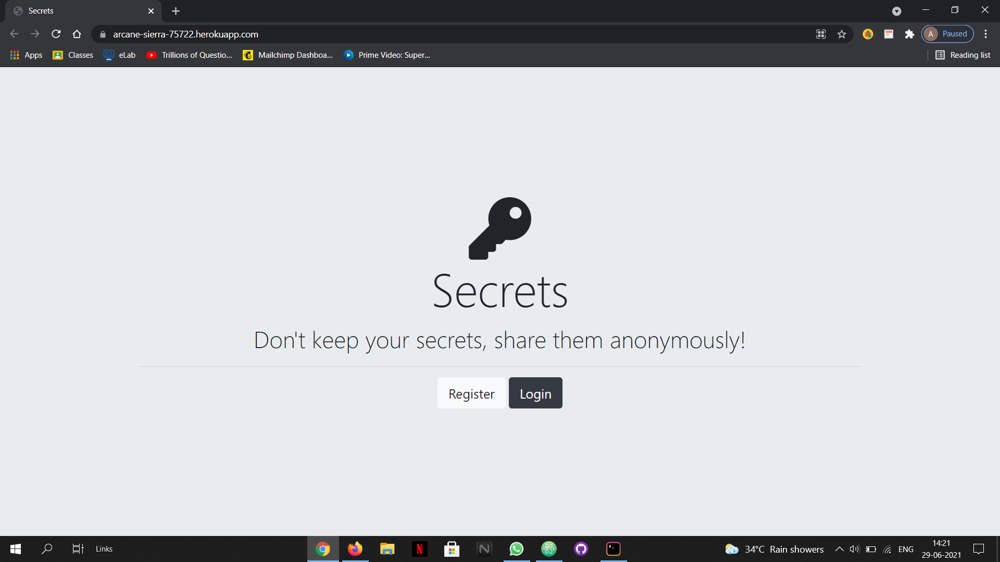

# secrets-app
This web app is developed for those who want to share their secrets anonymously to the world just by logging on to the site. The app is secured by using passport package of node.js
and using Google and Facebook API's for logging on the site.  
# Front-end technologies used:
1. HTML5 
2. CSS3 
3. Bootstrap v4 
# Back-end technologies used:
1. Node.js 
2. Express.js 
3. EJS 
4. MongoDB (database) 
# Build and Run in your PC:
1. Download the code in the  project directory and install npm packages by command "npm install" on the console after navigating to the project folder.  
2. Obtain your Google and Facebook Client_id and Client_secret and put them in .env file. 
3. Now open another tab on console and start mongoDB server.
3. Now run the app server on the console by typing "node app.js".
4. Go to localhost:3000 from the chrome browser and the website will be visible.  
5. Check out my web app through this link --> <a href="https://arcane-sierra-75722.herokuapp.com">My secrets-app<a>
# Site Preview

